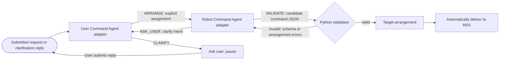

# Controlled typed UCS

This development harness implements the agreed LangGraph routes: two role adapters, clarification when needed, Python validation, and automatic delivery of a valid target. There is no target-confirmation step.

The role adapters are deterministic Python substitutes, not LLM agents. The User Command adapter accepts explicit animal-position pairs, combines clarification replies, and hands off an explicit assignment. Missing information triggers a scripted question. The Robot Command adapter creates candidate command JSON, selects `VALIDATE`, and uses gate feedback to select `ASK_USER` for conflicting intent. Tests inject generation mistakes to exercise automatic repair and exhaustion. The RES adapter emits in-process simulated progress and results. The harness does not call Ollama, MQTT, Google, or robot hardware.

`create_controlled_app` explicitly supplies these adapters. The general `create_app` factory requires a User Command Agent, Robot Command Agent, and Robot Execution Station adapter; it has no hidden fallback.

## Run

```bash
python3 -m venv .venv
.venv/bin/python -m pip install --upgrade pip
.venv/bin/python -m pip install -e '.[dev]'
.venv/bin/uvicorn 'ucs_app.controlled:create_controlled_app' --factory --host 127.0.0.1 --port 8000
```

Open <http://127.0.0.1:8000>. Use these controlled examples:

The controlled RES waits five seconds between its BUSY status and completion so
the execution stage is visible during the demo. Programmatic callers can override
this with `create_controlled_app(result_delay_seconds=...)`.

| Input | Behaviour |
|---|---|
| `elephant left, bear centre, hippo right` | Validate and send automatically; display execution `COMPLETED`, verification `NOT_RUN`. |
| `elephant left` | The User Command adapter asks for missing positions before handing off an assignment. Reply `bear centre, hippo right`. |
| `elephant left, bear centre` | Infer hippo right, then validate and send without a question. Two distinct explicit positions uniquely determine the third. The same rule applies after a clarification reply. |
| `elephant left, elephant right, bear centre` | Ask which elephant destination is intended; do not infer through contradictory instructions. |
| `elephant left, bear left, hippo right` | Validation fails and returns to the Robot Command adapter, which requests clarification through the User Command adapter. Reply `bear centre`; the full target is re-derived and validated before automatic delivery. |
| Unrecognised wording | Ask for supported input. Reply with a complete, valid three-animal arrangement to restate the target; partial replies cannot discard unsupported earlier instructions. |

The browser shows one Status panel: Ready, Processing request, Needs clarification,
Executing, Completed, Failed, Not started, Cancelled, or Outcome unknown. Connection
loss uses the same panel. Execution/verification details remain in the application
and activity trail, rather than separate status cards. Completed explicitly means
simulated completion, without physical verification.

Clarification appears in a highlighted question panel with the original request and a focused answer field. The activity trail resets when a new arrangement request starts; replies keep the history for that request. Refresh and SSE reconnect restore unfinished requests, including the current question, answers, target, status, and request trail. Finished requests reopen as Ready with the old target and trail cleared. Input stays disabled until that snapshot arrives. To start over while a clarification is pending, select Cancel request first.

A pending clarification can be cancelled without sending a command. The page uses the project heading; this composition remains a controlled harness as documented here. Exact-pair parsing does not establish natural-language understanding or real-model agentic behaviour.

## LangGraph workflow



The gate checks the command schema and arrangement rules, verifies equality with the interpreted assignment, and protects application-generated metadata. It returns feedback to the Robot Command adapter for at most two repair attempts after the initial candidate. Conflicting intent is escalated through `ASK_USER`; the User Command adapter must ask and wait for a real reply. Exhaustion and malformed role actions stop without dispatch or an internal-error question. Application code delivers the exact validated candidate.

The session retains the original request and clarification replies alongside LangGraph's in-memory checkpoints. A reply supplies that saved context to the same workflow identifier. The successful agentic output is the validated Target arrangement; deterministic application code handles delivery, progress, and terminal results.

## Browser endpoints and guards

- `POST /arrangement-requests`: `{request_id, text}` starts a new request. `request_id` is a browser-generated UUID retained on retry; a reused identifier cannot dispatch again.
- `POST /clarifications`: `{workflow_id, turn, text}` answers the current question.
- `POST /clarifications/cancel`: `{workflow_id, turn}` cancels a pending question.
- There is no confirmation endpoint or Confirm button.

An HTTP-only cookie scopes state to the browser session. A session permits one in-flight request or Active command. Workflow identifiers and turn counters reject stale or duplicate replies, and other sessions cannot answer the question. Requests are limited to 4,000 characters and 256 unique request identifiers per session.

Defaults are 12 agent calls per workflow, 3 clarification questions, 2 repair attempts per interpreted assignment, 20 seconds per agent call, and 30 seconds for execution. Clarification pauses do not consume agent calls. A user reply cannot reset the accumulated call budget. Pending questions can be cancelled; no automatic reply is generated.

Application code revalidates the exact candidate and command envelope immediately before dispatch. RES responses must match `message_id`; missing, malformed, mismatched, or duplicate terminal updates leave the outcome unknown and block new execution. No automatic resend occurs. Failed execution is displayed as failed rather than as successful completion.

Session/checkpoint state and duplicate tracking are in memory by default. [Opt-in durable recovery](recovery-and-evaluation.md) preserves session guards and clarification context; independent late results require the MQTT composition. Page refresh does not reset or cancel an active command. A simulated result is not physical or visual verification.

## Checks

```bash
.venv/bin/python -m playwright install chromium
.venv/bin/pytest
.venv/bin/mypy
.venv/bin/python -m pip check
```

Browser tests cover successful command repair, exhausted repairs without user questions, delivery without confirmation, invalid-target clarification, cancellation, failed execution, unknown outcomes, and refresh during clarification, completion, active execution, and uncertain execution. Workflow tests cover all six arrangements, role feedback, malformed/unauthorized actions, stale and cross-session replies, concurrent submissions, bounded calls and questions, timeouts, and uncertain or failed execution outcomes. These tests verify controlled routing and application guards, not real-model accuracy.

Clarification answers appear below the original request while clarification is pending, and are restored after refresh. Both controlled and live agents receive the original request and all actual replies. In controlled mode, a later complete, unambiguous explicit-pair answer restates the target and permits recovery from unsupported earlier wording; this does not add general natural-language understanding.
