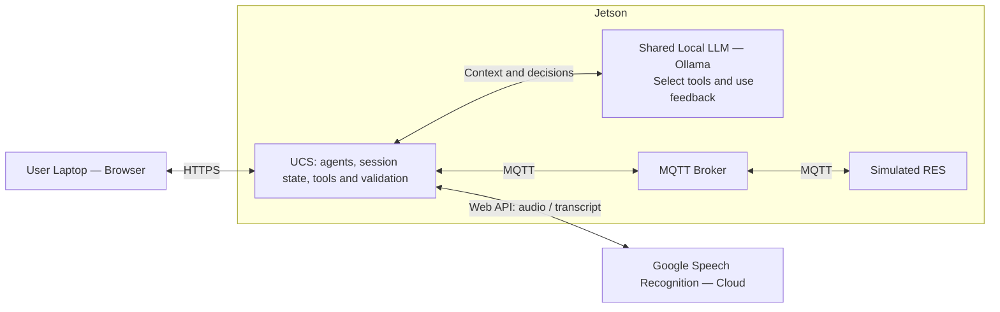
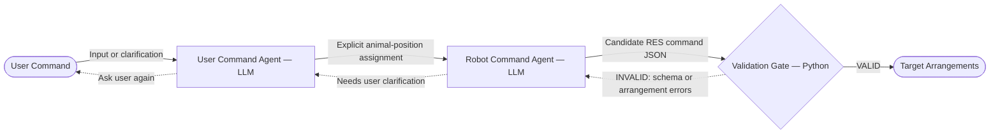

# System design

This document specifies the target system. The [controlled composition](controlled-ucs.md) implements these graph routes and automatic delivery with deterministic substitutes for the two agent roles and RES. Real LLM decision-making, MQTT, and speech input are separate integration work; passing harness tests does not establish agentic model behaviour.

## Scope and roles

A Target arrangement assigns the elephant (`E`), bear (`B`), and hippo (`H`) exactly once to distinct `front_left`, `front_center`, and `front_right` positions. Support all six permutations, including requests beyond size ordering.

- **User Command Agent:** interpret requests, resolve missing information with the user, and pass an explicit animal-position assignment with the original request and replies.
- **Robot Command Agent:** construct candidate RES command JSON from that assignment, use validation feedback to repair generation errors, or request user clarification through the User Command Agent.
- **Validation Gate:** Python checks the complete command schema, arrangement rules, unchanged application metadata, and equality with the interpreted assignment. This safety-oriented design blocks malformed or invalid commands; it does not establish correct interpretation of the original request or physical robot safety.

LangGraph coordinates the roles. One shared local LLM served by Ollama, using separate role instructions and sequential calls, is the proposed deployment. Model tool-calling capability and Jetson performance require testing. A distinct role does not require a separately loaded model.

## System architecture

The browser submits requests, answers questions, and displays progress and results. The application validates targets and sends them automatically to the Simulated RES. Public topics are `robot/command`, `robot/status`, and `robot/result`; credentials and broker access stay server-side.

## Agentic workflow

Validation failure returns the candidate and feedback to the Robot Command Agent with the unchanged interpreted assignment and request evidence. Permit two repair attempts after the initial candidate, configurable with `max_repairs`. Every candidate passes the same Python gate. Repairs cannot choose different positions or overwrite system metadata. If resolving a conflict requires revised intent, the Robot Command Agent selects `ASK_USER`; the User Command Agent asks a question and waits for an actual reply. A revised assignment starts a new repair budget, while the overall agent-call and clarification budgets persist.

Python generates the message identifier and timestamp once per interpreted assignment. The Robot Command Agent includes that metadata in its candidate. Application code sends the exact validated command without regenerating it. Exhausted repairs, malformed role actions, and technical tool/model failures stop without dispatch; they do not ask the user to fix internal errors.

The successful agentic output is one Target arrangement. Application code then sends the exact validated target automatically, without a separate confirmation step. Execution status and results belong to the wider system workflow.

## Application rules

- Do not dispatch while the request is unsupported, ambiguous, incomplete, or invalid.
- Bind validation and dispatch to the current request revision and session; stale candidates cannot execute.
- Permit one Active command per browser session and prevent repeat dispatch for duplicate calls or resumptions. Validate and correlate RES messages by `message_id`.
- Never automatically resend after uncertain delivery or missing results. Preserve unresolved command state and define late-result reconciliation.
- Bound agent steps and clarification turns; wait for real user replies. Exhaustion or cancellation before dispatch ends without a command. Cancellation after dispatch does not establish that execution stopped.
- Simulated completion uses execution `COMPLETED` and verification `NOT_RUN`. It does not prove physical placement or visual verification.

## Speech and evaluation

Speech recording is user-initiated. UCS sends recorded audio to Google for transcription and returns editable text; the user must submit it before interpretation. Provide typed fallback, disclose external audio processing, and avoid retaining raw audio or unrestricted recognizer responses. The browser deployment needs a secure context for microphone capture; verify the speech adapter's actual transport during implementation.

Evaluate intent fidelity across all six arrangements, useful clarification, invalid-input handling, observable action selection and tool-feedback adaptation, and latency. Separate real-model measurements from deterministic validation and delivery tests. Include stale/duplicate requests, unavailable dependencies, and uncertain delivery. Agent labels and diagram loops alone are not evidence of agentic behaviour.

The controlled implementation uses strict action schemas and configurable limits: 12 agent calls, 3 clarification questions, 2 repair attempts after the initial candidate, 20 seconds per agent call, and 30 seconds for execution. Model choice, prompts, durable dispatch persistence, recovery details, and the evaluation protocol still require implementation and evaluation. State and deduplication are in memory; they do not survive a restart. Physical control, ROS, perception, fine-tuning, and comparative model studies are outside the baseline.
